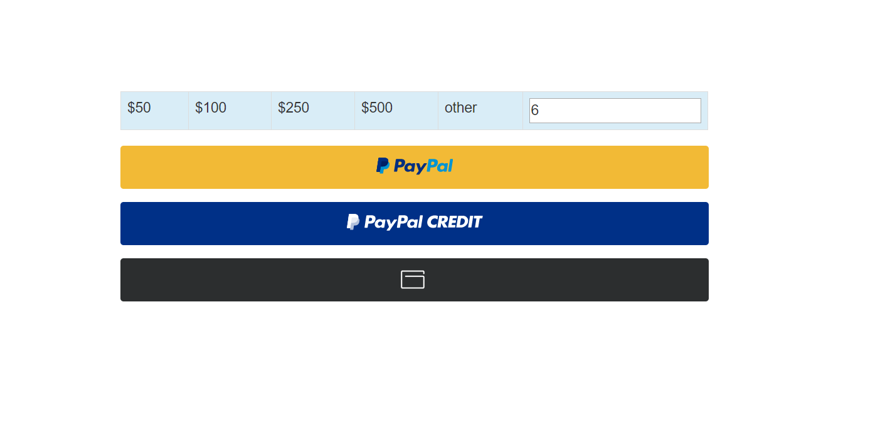

# DONATE  BY USING REST API SDK for PHP V2 - SERVER INTEGRATE



__Welcome to PayPal PHP SDK__. This repository contains PayPal's PHP SDK and samples for [v2/checkout/orders](https://developer.paypal.com/docs/api/orders/v2/) and [v2/payments](https://developer.paypal.com/docs/api/payments/v2/) APIs.

This is a part of the next major PayPal SDK. It includes a simplified interface to only provide simple model objects and blueprints for HTTP calls. This repo currently contains functionality for PayPal Checkout APIs which includes [Orders V2](https://developer.paypal.com/docs/api/orders/v2/) and [Payments V2](https://developer.paypal.com/docs/api/payments/v2/).

Please refer to the [PayPal Checkout Integration Guide](https://developer.paypal.com/docs/checkout/) for more information. Also refer to [Setup your SDK](https://developer.paypal.com/docs/checkout/reference/server-integration/setup-sdk/) for additional information about setting up the SDK's. 
## Latest Updates
Beginning January 2020, PayPal will require an update on the Personal Home Page (PHP) Checkout Software Developer Kit (SDK) to version 1.0.1. Merchants who have not updated their PHP Checkout SDK to version 1.0.1 will not be able to deserialize responses using outdated SDK integrations.
All PHP Checkout SDK integrations are expected to be updated by March 1, 2020. Merchants are encouraged to prepare for the update as soon as possible to avoid possible service disruption.
The Status Page has been updated with this information. The bulletin can be found [here](https://www.paypal-status.com/history/eventdetails/11015)

## Prerequisites

PHP 5.6 and above

An environment which supports TLS 1.2 (see the TLS-update site for more information)

## Usage

### Binaries

It is not mandatory to fork this repository for using the PayPal SDK. You can refer [PayPal Checkout Server SDK](https://developer.paypal.com/docs/checkout/reference/server-integration) for configuring and working with SDK without forking this code.

For contributing or referring the samples, You can fork/refer this repository. 

### Setting up credentials
Get client ID and client secret by going to https://developer.paypal.com/developer/applications and generating a REST API app. Get <b>Client ID</b> and <b>Secret</b> from there.

```php
require __DIR__ . '/vendor/autoload.php';
use PayPalCheckoutSdk\Core\PayPalHttpClient;
use PayPalCheckoutSdk\Core\SandboxEnvironment;
// Creating an environment
$clientId = "<<PAYPAL-CLIENT-ID>>";
$clientSecret = "<<PAYPAL-CLIENT-SECRET>>";

$environment = new SandboxEnvironment($clientId, $clientSecret);
$client = new PayPalHttpClient($environment);
```

## Examples
### Creating an Order
#### Code:
```php
// Construct a request object and set desired parameters
// Here, OrdersCreateRequest() creates a POST request to /v2/checkout/orders
```On Client```

createOrder: function(data, actions) {
                return fetch('/create-transation', {
                    method: 'post',
                    body:JSON.stringify($('#donateamount').val()),
                    headers: {
                        'content-type': 'application/json'
                    },
                }).then(function(res) {
                    return res.json();
                 })
                .then(function(data) {
                    return data.id;//***important***
                });
            },

            // Finalize the transaction
            onApprove: function(data, actions) {

                return fetch('/capturtransation', {

                    method:'POST',
                    headers: {
                    'content-type': 'application/json'
                    },
                     body: JSON.stringify(data.orderID),

                }).then(function(res) {
                    return res.json();
                 })
                .then(function(details) {
                    
                    actions.redirect('/return_url');
                    return details.id;
                });             
              
            },
            onCancel: function(data,actions){
                actions.redirect('/cancel_url');
            }
```
```JSON anlysis and synchronization``

$contentType = isset($_SERVER["CONTENT_TYPE"]) ?
        trim($_SERVER["CONTENT_TYPE"]) : '';

        if ($contentType === "application/json") {

            $content = trim(file_get_contents("php://input"));            
            $decoded = json_decode($content, true);

        if(!isset($decoded)) {

                print_r($decoded);

             } else {                
               
                CreateOrder::createOrder(true,(int)$decoded);
             }
         }

## Samples

You can start off by trying out [creating and capturing an order](/samples/CaptureIntentExamples/RunAll.php)

To try out different samples for both create and authorize intent check [this link](/samples)

Note: Update the `PayPalClient.php` with your sandbox client credentials or pass your client credentials as environment variable whie executing the samples.


## License
Code released under [SDK LICENSE](LICENSE)  
